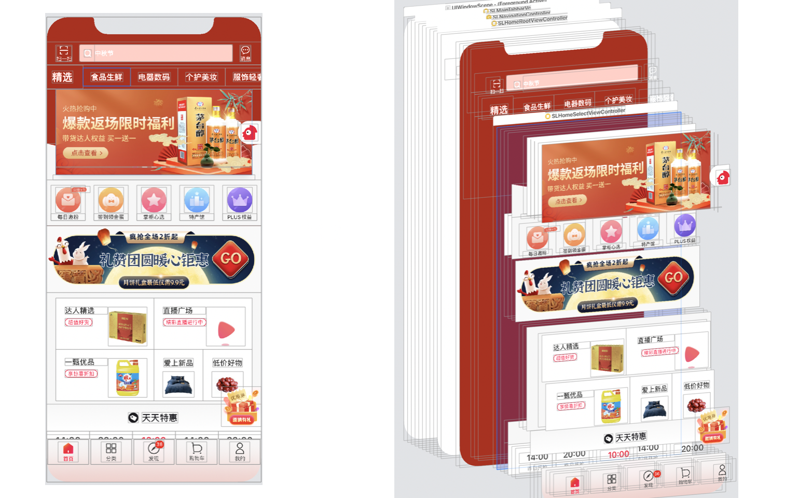
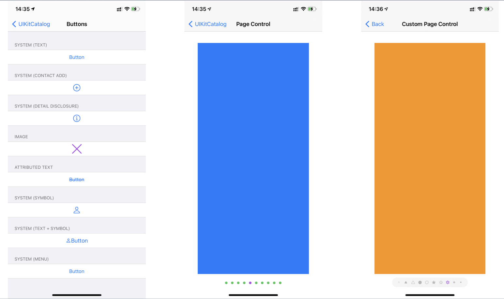
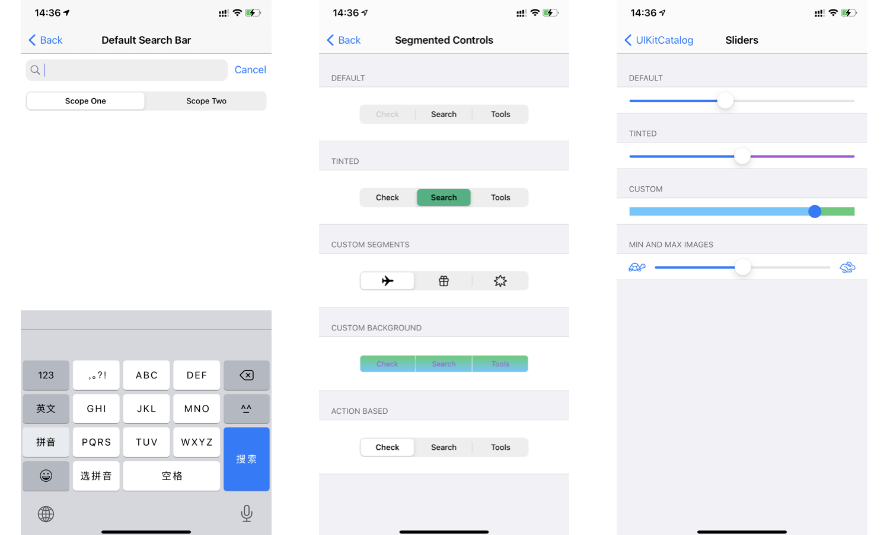
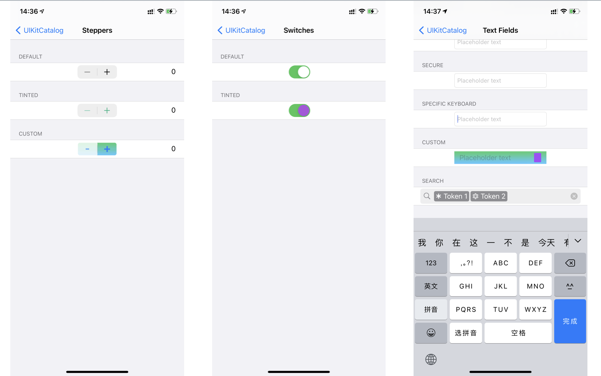
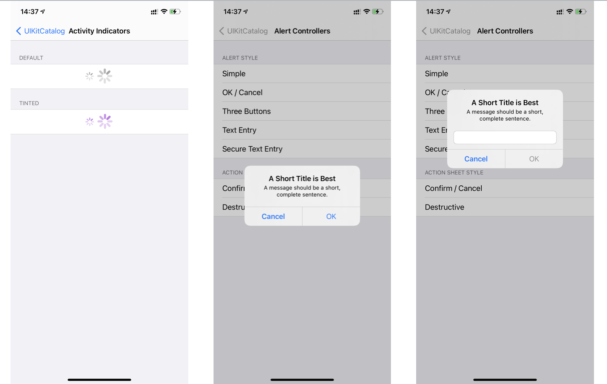
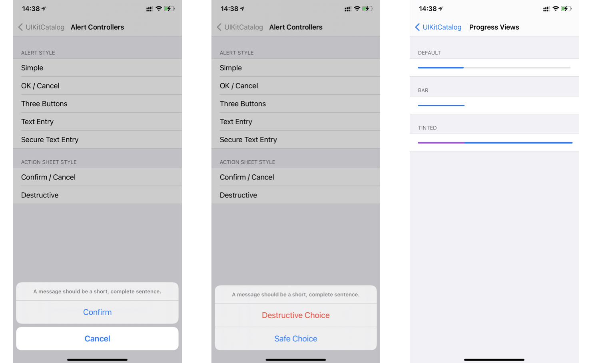
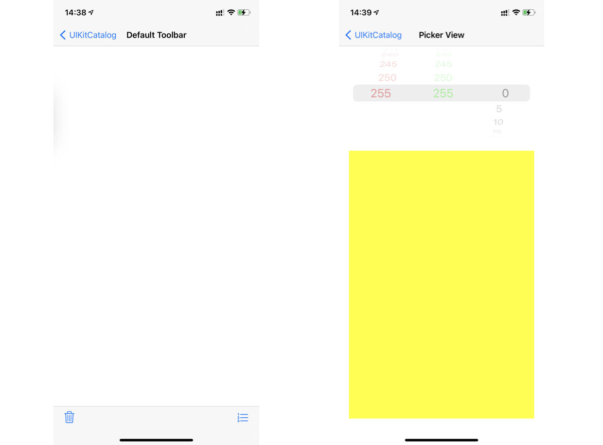

iOS为一名iOS开发者，在日常工作中常常会遇到设计师，产品经理犯一些常识性的错误，令人啼笑皆非。有些扯皮，因为没有共识，浪费了很多时间。部分设计师和产品经理对iOS系统的理解停留在表面。我这篇分享，将从程序员的角度带你去认识一下iOS系统的UI。

读完之后的目标：

- 认识iOS操作系统中大部分系统控件的UI

- 理解iOS开发中视图组织的内部逻辑

- 一些常识

- 一些设计资源的分享

<!--more-->

### UIKit

iOS系统中，用于显示界面的UI库叫`UIKit`，`UIKit`中有丰富的UI控件帮助开发者快速的构建美观，功能丰富，符合苹果设计规范的UI界面。

苹果官方写了一个App，用来展示UIKit中的组件，这里是[地址](https://developer.apple.com/documentation/uikit/mac_catalyst/uikit_catalog_creating_and_customizing_views_and_controls)，如果地址失效了，请用关键字`Apple UIKitCatalog`搜索。有条件的可以自己在Mac电脑上下载Xcode软件，连接电脑安装。也可以自己找iOS开发的程序猿来帮你安装到手机上。

下面的分享中，我将使用这个App中的截图，来介绍UIKit中控件。

我的手机的iOS系统版本是`iOS14.0.1`

##### UIView

`UIView`是UIKit中最基础的控件，所有其他控件都是继承于UIView。UIView相当于ps中的一个画板，即可以作为一个容器，放置其他控件视图，又可以单独当做一个空间使用。

UIView有以下属性：

- 大小、位置、背景颜色、是否隐藏

- 圆角、阴影

- 手势触控（点击，滑动，拖动，捏合，长按）

同样的，继承UIView的其他视图也都是有这些属性的。

下图即是一个iOS App的首页。它的可见部分全部都是由UIView及其子类控件组成的。各种控件大大小小相互嵌套就组成了各种页面。

##### 各种控件

以下控件都是继承于UIView，即UIView有的属性，它们也都有，同时它们也有UIView没有的特性。

**UIButton**

`UIButton`为按钮控件，常用于点击事件。按钮可设置图片和文本。按钮是一种可设置状态的控件。比如普通状态(normal)，选中状态(selected)，高亮状态(highlighted)，禁用状态(disabled)等，开发者可以为按钮的每个状态设置不同的图片和文本。

下图左侧Buttons展示了各种按钮，其中标明System为系统图标。

**UIPageControl**

`UIPageControl`为页码控制器，通常用于指示轮播图的位置，控制器的指示视图默认为圆点。开发者可自定义页码控制器上指示视图（即上图中页面Page Control，小圆点）的图片。上图右侧图Custom Page Control为自定义指示视图的页面。

**UISearchBar**

`UISearchBar`为搜索框， 下图Default Search Bar中展示的即是。搜索框可自定义搜索图标🔍的图片，以及文本的字体大小颜色，取消按钮的文本，样式等，Scope范围的设置为可选项。

UISearchBar和列表视图放在一起时，再搭配UISearchController，可以带动画效果的搜索视图，具体可以在iPhone->设置页面看到。

**UISegmentView**为分段控制器，分段控制器可以自定义各种样式，如上图Segmented Contols。开发者可以设置分段控制器按钮的背景色，选中色，甚至可以将按钮设置为图片。分段控制器通常放在页面的导航栏区域，用来分页或者分类数据，在iPhone->最近通话的导航栏区域可看到。

**UISlider**为滑块，由一个进度条和拇指可拖动视图（小圆点）组成，如上图Siders中展示的那样。开发者可以自定义滑块进图条的前景色，背景色，粗细，也可以设置拇指视图（圆点）的大小颜色，样式。

**UIStepper**为步进器，UI样式如下图，常用于一些较小数值值的加减操作，典型场景打印页面的页数。开发者可自定义背景色，左右加减符号的图片，分割线的图片，加减值的大小。

**UISwitch**为开关。常用于设置页面某项设置的开关。

**UITextField**为单行输入框，常用于输入用户名，密码，或搜索。开发者可设置占位文本用于提醒，每个UITextField有左右视图，默认不显示，开发者可自定义显示，比如上图中第四个UITextField，设置了左右两个视图，开发者可设置文本大小，字体，颜色，是否是密码输入（即输入后变为黑点），视图背景色等，不过不能换行。

**UITextView**为多行输入框。常用于输入较长的文本。UITextView的属性比UITextField少一些。开发者可设置文本大小，字体，颜色，不支持密文输入，支持富文本编辑，插入图片（自定义表情）等，Apple的Demo中没有UITextView的示例，你可以参考微信朋友圈发布新内容时的输入框。

**UIActivityIndicatorView**是活动指示器，如下图，通常用于表示页面加载中。

**UIAlertController**是警告框。警告框有两种样式，一种是在屏幕中间的，如上图，可以自定义左右两边的按钮，也可以在警告框中添加单行输入框。另一种是动作表单（Action Sheet），如下图，通常用于多个可选择操作。

UIProgressView是进度条，开发者可设置进度条的前景色，背景色，宽高等。

UIToolBar为工具栏，位于页面的下方，可放置一些操作按钮。

UIPickerView是选择器。通常用于时间，日期等数字的选择。开发者可以设置选择器的列数和行数，以及每个条目的文本信息，下图中是3列，255行。

以上就是一些常用的苹果官方控件。

苹果在设计这些控件和视图时，会遵循六个设计原则，这六个设计原则放在苹果iOS[人机界面指南](https://developer.apple.com/design/human-interface-guidelines/ios/overview/themes/)的首页。建议去官网观看。

苹果六大设计原则

- 美学完整性(Aesthetic Integrity)

- 一致性(Consistency)

- 直接操作性(Direct Manipulation)

- 反馈(Feedback)

- 隐喻(Metaphors)

- 用户控制(User Control)

同样，如果你想了解更多，可以去苹果设计官网进行观看学习。

苹果设计（https://developer.apple.com/design/resources/ ）

苹果设计相关视频（https://developer.apple.com/videos/design/ ）
